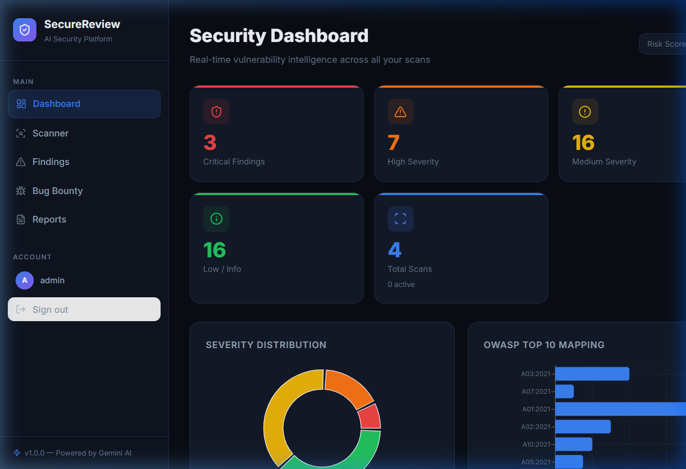
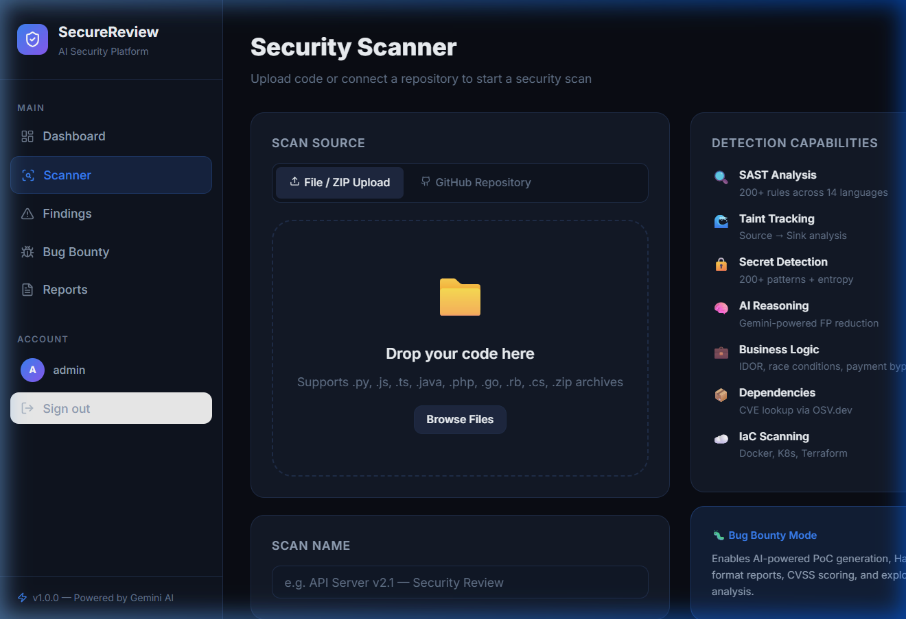
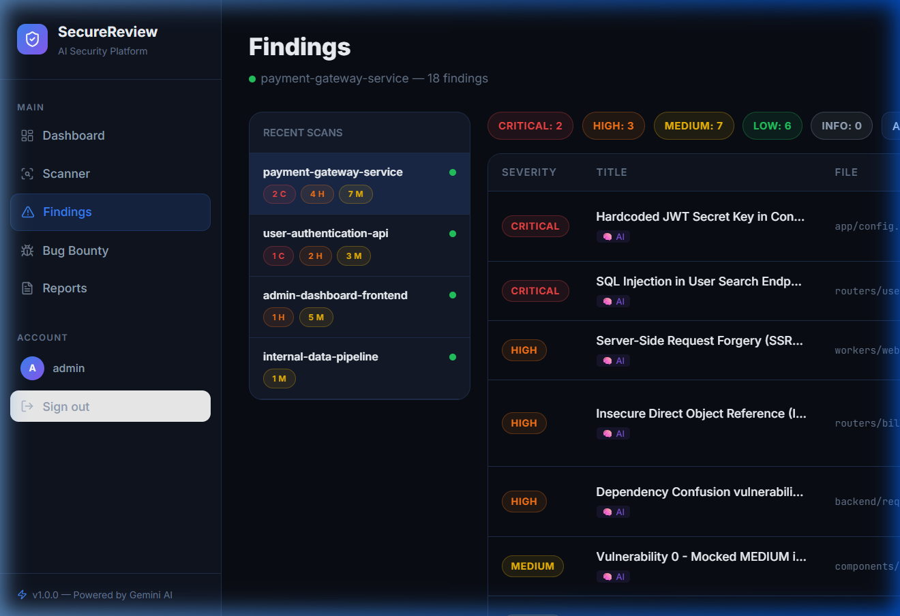
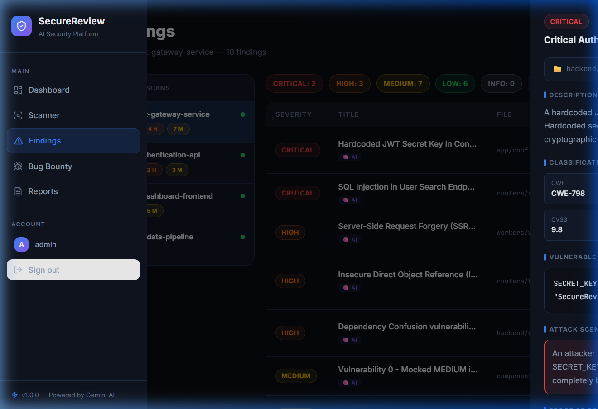
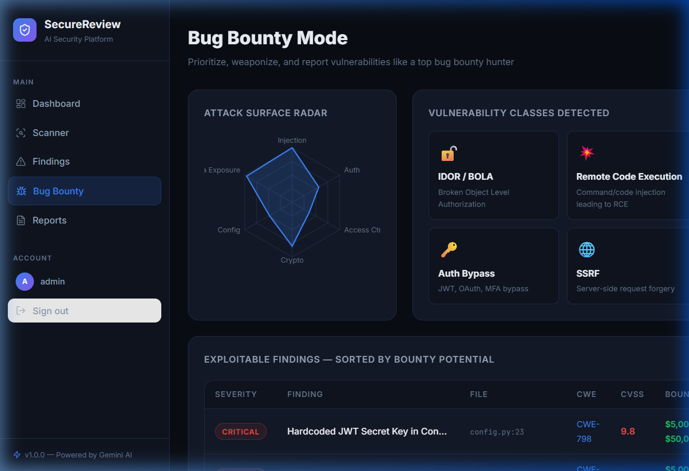
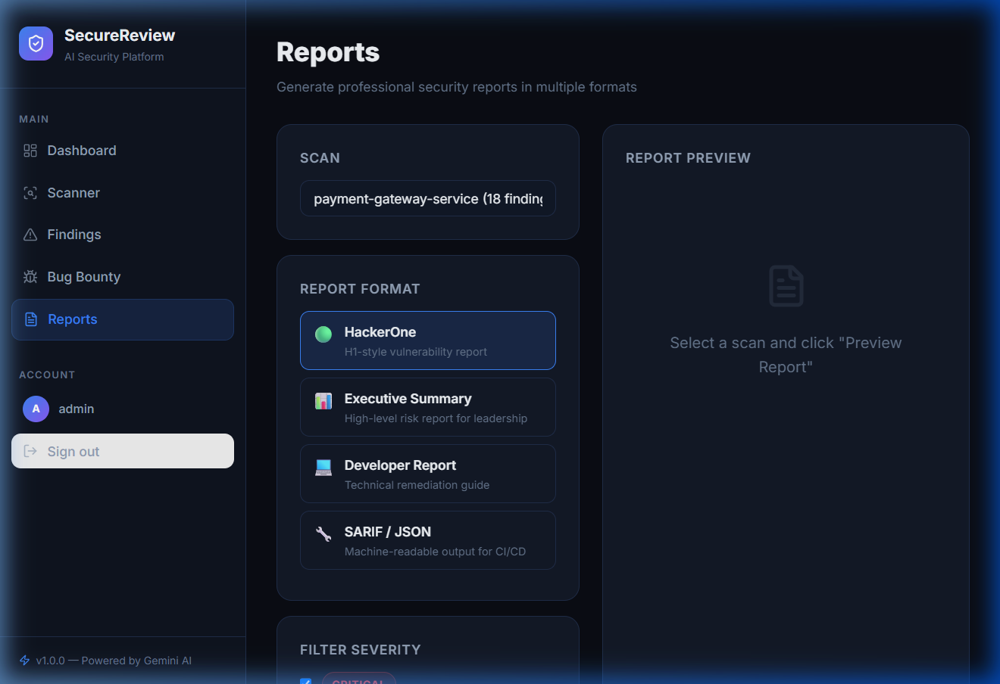

# 📷 SecureReview AI Platform — Interface Screenshots

This file contains screenshots of the active **SecureReview AI Platform** web interface, showing the core screens, security analytics dashboard, AI-powered vulnerability analysis drawer, scanner, bug bounty dashboard, and compliance report exporter.

---

## 📊 1. Security Dashboard
The dashboard provides a real-time consolidated overview of the security state of the scanned applications, including risk score, total findings, vulnerability severity distribution, and OWASP Top 10 breakdown.

---

## ⚡ 2. Security Scanner
The scanning interface allows users to initiate a new security scan by uploading source code files / ZIP archives, or by connecting a GitHub repository, utilizing customizable scanning profiles (Quick, Standard, Deep, Bug Bounty).

---

## 🔍 3. Findings List
The findings view lists all detected security issues for a scan, filtered by severity (Critical, High, Medium, Low, Info) and category, showing the file path, line numbers, and detection engine.

---

## 🧠 4. Finding Details & AI Remediation Drawer
Clicking a finding opens a detailed side panel containing the vulnerable code snippet, taint flow source-to-sink tracking, attack scenario walkthrough, automatically generated proof of concept, estimated bug bounty reward, and step-by-step remediation instructions with a secure code example.

---

## 🐛 5. Bug Bounty Mode
Bug Bounty Mode visualizes the attack surface on a radar chart and lists potential vulnerabilities prioritized by monetary value. It estimates bounties and aggregates high-severity bugs to highlight the most critical risks.

---

## 📋 6. Executive & Technical Compliance Reports
The reports module supports exporting security findings into multiple formats, including HackerOne-style bug reports, Executive Summaries for leadership, Developer Remediation Guides, and machine-readable SARIF/JSON schemas for CI/CD integrations.

